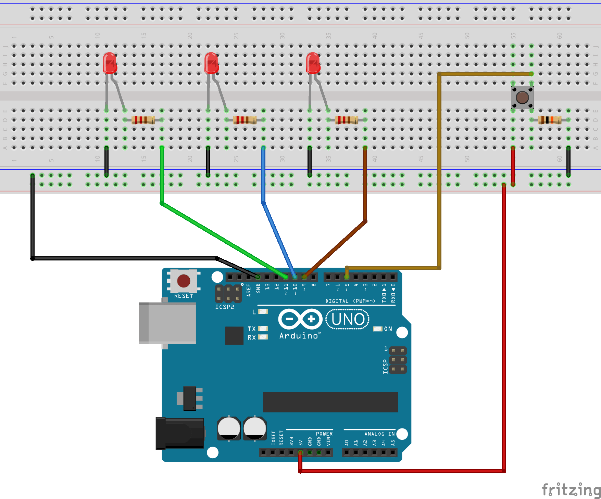

**Lecture Explanation on Protothreads**
- non preemtive
    - only one thread has control at a time 
    - thread has control until __you__ release it
[Hunter Adams' Lecture](https://youtu.be/aWsgEs7Zstk?t=2221)

**Important things to know about Protothreads**
Protothreads are great, and with Arduino they bring a new set of nice features to achieve something close from multi-threading, with a very low overhead.

However, you have to be aware of some important information and limitations:

- Basically a protothread overhead is only 2 bytes, so you don’t need to worry about hidden memory costs during the program execution.
- You can’t use local variables inside protothreads. Those are not preserved when the program blocks. Use global variables or “static” keyword instead.
- The execution of your code inside a protothread must be fast (between two PT_WAIT_UNTIL), or else you will block the rest of the program. Remember: true multi-threading doesn’t exist on Arduino, only one line of code is executed at a time. So, don’t use delay() or any other blocking function, ever.
- Call all your protothreads in your loop() function, as fast as possible (see point above).
- Under the hood, protothreads are just C macros. When you write a protothread the code will be transformed into a switch statement, nothing more. Protothreads are just here to make your programming life simpler, but it won’t do everything for you.
- To get more advanced knowledge about protothreads, -> [read the notes from Adam Dunkels](http://dunkels.com/adam/pt/about.html), the library author.

**Sources**
- [Tutorial and Examples](https://roboticsbackend.com/arduino-protothreads-tutorial/)
- [Multiple Threads Example](https://roboticsbackend.com/arduino-protothreads-tutorial/#:~:text=the%20library%20author.-,Multiple%20Protothreads%20in%20the%20same%20Arduino%20Program,-If%20you%20chose)
